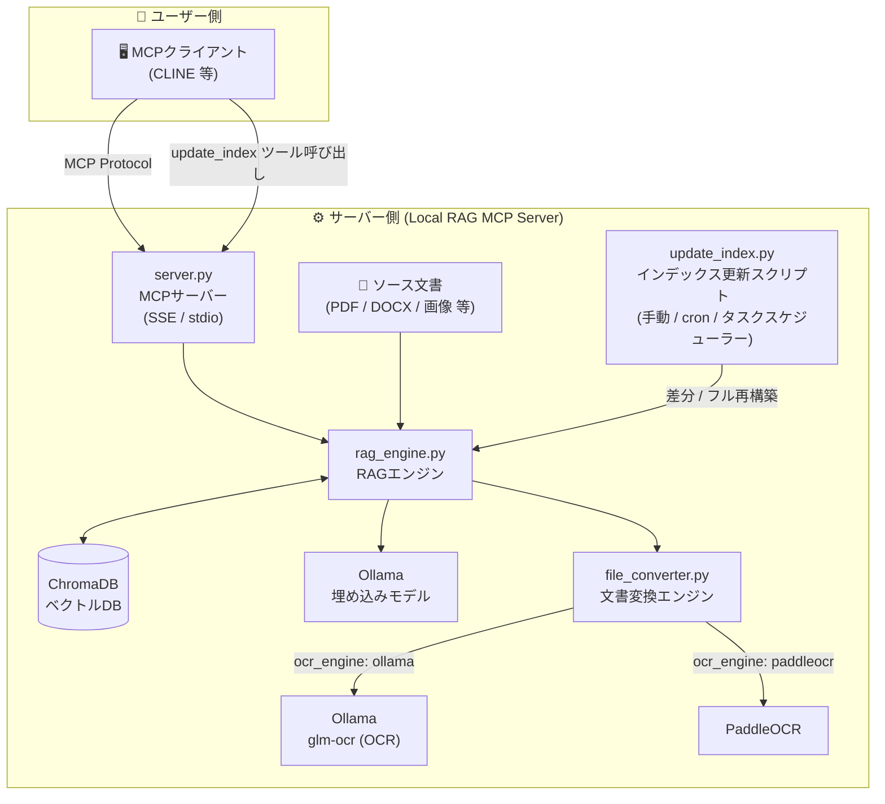

# Local RAG MCP Server

ローカル PC またはサーバー上の共有フォルダにある文書ファイルを AI から自然言語で検索できる **MCP (Model Context Protocol) サーバー** です。

PDF・Word・Excel・PowerPoint・画像・ソースコードなど多様なファイルを自動変換してベクトルインデックス化し、Ollama の埋め込みモデルを使用したセマンティック検索 (RAG) を提供します。CLINE などの MCP 対応クライアントから利用できます。

> 📋 更新履歴は [CHANGELOG.md](CHANGELOG.md) を参照してください。

> [!WARNING]
> **【重要】Ollama v0.17.x系における `glm-ocr` の不具合について**
> 現在、Ollama v0.17.x系と `glm-ocr` モデルの組み合わせで、OCR結果が正常に出力されない（空白・文字化け・異常な繰り返しになる）問題が確認されています。
> これを回避するため、以下の**いずれか**の対策を実施してください：
> 1. Ollama のバージョンを **v0.16.3** にダウングレードする（推奨）
> 2. OCR用に別のヴィジョンモデル（`llava` 等）を使用する
> 3. OCRエンジンを **PaddleOCR** に切り替える
> 
> ※ 詳細は[トラブルシューティング](#ollama-v017x-で-glm-ocr-を使用している場合)をご参照ください。

## 機能一覧

| 機能 | 説明 |
|------|------|
| 文書変換 | PDF・DOCX・XLSX・PPTX・画像 → Markdown 変換（OCR対応） |
| セマンティック検索 | Ollama 埋め込みモデルによるベクトル検索 |
| アクセス制御 (ACL) | API キーによるルートフォルダ単位の検索権限管理 |
| 差分同期 | 更新ファイルのみ再インデックス（mtime 管理） |
| SSE / Stdio 両対応 | CLINE (SSE) や stdio MCP クライアントどちらでも利用可能 |

## アーキテクチャ概要




# 🔧 管理者向けガイド

## 1. 必要環境

- Python 3.10 以上
- [Ollama](https://ollama.com/)（ローカル実行）
  - 埋め込みモデル（例: `nomic-embed-text-v2-moe:latest`）
  - OCR モデル（例: `glm-ocr:latest`）

## 2. インストール

```bash
# 1. リポジトリを任意のフォルダに配置

# 2. 仮想環境を作成して有効化
python -m venv venv
venv\Scripts\activate        # Windows
# source venv/bin/activate   # Linux / macOS

# 3. 依存パッケージをインストール
pip install -r requirements.txt

# 4. PaddleOCR用バックエンドのインストール (PaddleOCRを使用する場合のみ)

デフォルトでは安定動作のため **CPU版** の利用を推奨しています。
```bash
pip install paddlepaddle
```

> [!WARNING]
> GPU版の導入は特定のDLL (`cudnn64_8.dll`, `zlibwapi.dll`) の手動配置が求められるため**上級者向け**です。どうしてもGPU版を利用したい場合は、[PADDLE_GPU_SETUP.md](PADDLE_GPU_SETUP.md) の手順に従って個別にセットアップを行ってください。
```

## 3. 初期設定

### config.json

`config.json` を自分の環境に合わせて編集してください。

```json
  "source_docs_dir": "C:\\path\\to\\your\\documents",
  "docs_dir": "converted_docs",
  "embedding_model": "nomic-embed-text-v2-moe:latest",
  "ocr_engine": "paddleocr",
  "ocr_model": "glm-ocr:latest",
  "paddleocr_use_gpu": false,
  "ollama_base_url": "http://localhost:11434",
  "db_dir": "./chroma_db",
  "collection_name": "mcp_rag_collection"
}
```

| キー | 説明 |
|------|------|
| `source_docs_dir` | 元文書フォルダの**絶対パス**（共有フォルダを指定） |
| `docs_dir` | 変換済み Markdown の保存先（相対パス） |
| `embedding_model` | Ollama の埋め込みモデル名 |
| `ocr_engine` | OCRエンジン（`ollama` または `paddleocr`） |
| `ocr_model` | PDF/画像の OCR に使う Ollama モデル名 (ocr_engine が ollama の場合) |
| `paddleocr_use_gpu` | PaddleOCR実行時にGPUを使用するかどうか (`true` または `false`) |
| `ollama_base_url` | Ollama の API エンドポイント |
| `db_dir` | ChromaDB の保存先（相対パス） |
| `collection_name` | ChromaDB コレクション名 |

### ドキュメントフォルダの構成

本サーバーの基本的な運用思想は、**既存の共有フォルダをドキュメントフォルダ（`source_docs_dir`）として設定する**ことです。ユーザーは普段通りに共有フォルダへファイルを追加・更新・削除できます。セキュリティは OS（Windows / Linux）のフォルダアクセス権で管理します。

`source_docs_dir` 直下に **ルートフォルダ** を作成し、その中に文書を格納してください。

> [!IMPORTANT]
> **ルートフォルダ名は英語を推奨します。**  
> 日本語フォルダ名も使用できますが、CLINE からデフォルト検索スコープを設定する際に URL への記載が必要になります。詳細は「[ユーザー向け：CLINE への接続設定](#cline-への接続設定)」を参照してください。

```
documents/                   ← source_docs_dir
├── Public/                  ← ルートフォルダ（誰でもアクセス可）
│   └── manual.pdf
├── Group A/                 ← グループA専用
│   └── design_spec.docx
└── Group B/                 ← グループB専用
    └── report.xlsx
```

### acl.json（検索アクセス権限の設定）

`acl.json` は **「API キーとルートフォルダのアクセス権限のマッピング」** を管理します。フォルダへの OS 権限とは独立した検索権限の設定です。

```json
{
  "_comment": "MCPサーバーのグループアクセス制御設定ファイル。",
  "_default": {
    "name": "Public",
    "allowed_roots": ["Public"]
  },
  "your-api-key-here": {
    "name": "Group A",
    "allowed_roots": ["Group A", "Public"]
  }
}
```

| エントリ | 説明 |
|---------|------|
| `_default` | API キー未設定で接続した場合に適用される権限 |
| `"キー文字列"` | そのキーを提示したクライアントが検索可能なルートフォルダを定義 |

> API キーは推測されにくいランダムな文字列を使用してください（例: `openssl rand -hex 32` で生成）。

**注意**: `acl.json` の変更はサーバー再起動まで反映されません。

### 3.4. 初回インデックスの作成

サーバーを初めて起動する前に、ドキュメントのインデックスを作成（データベース登録）する必要があります。**サーバーの起動だけでは自動的にインデックスは作成されません。**

以下のコマンドを実行して、ドキュメントのインデックスを作成してください。

```bash
# ドキュメントの同期（初回・差分更新）
python update_index.py
```

初回はドキュメントの量に応じて時間がかかる場合があります（特に OCR が必要な場合）。この処理が完了してから、次の「4. サーバーの起動・停止」へ進んでください。

## 4. サーバーの起動・停止

### 起動（SSE モード・CLINE などの HTTP クライアント向け）

```bash
python server.py --transport sse --port 8000
```

### 起動（stdio モード・MCP 標準入出力クライアント向け）

```bash
python server.py --transport stdio
```

### 停止

```bash
python stop.py
```

または、サーバーを起動したターミナルで `Ctrl+C` を押してください。

## 5. バックグラウンド常駐（本番運用）

### Ubuntu / Linux（systemd）

systemd サービスとして登録すると、OS 起動時に自動起動・クラッシュ時に自動再起動されます。

#### サービスファイルの作成

```bash
sudo nano /etc/systemd/system/local-rag-mcp.service
```

以下の内容を貼り付けてください（パスは実際の環境に合わせてください）。

```ini
[Unit]
Description=Local RAG MCP Server
After=network.target

[Service]
Type=simple
User=your-username
WorkingDirectory=/home/your-username/local-rag-mcp-servr
ExecStart=/home/your-username/local-rag-mcp-servr/venv/bin/python server.py --transport sse --port 8000
Restart=on-failure
RestartSec=5
StandardOutput=append:/home/your-username/local-rag-mcp-servr/server.log
StandardError=append:/home/your-username/local-rag-mcp-servr/server.log

[Install]
WantedBy=multi-user.target
```

#### サービスの有効化と起動

```bash
sudo systemctl daemon-reload
sudo systemctl enable local-rag-mcp   # OS起動時に自動起動
sudo systemctl start local-rag-mcp    # 今すぐ起動
sudo systemctl status local-rag-mcp   # 状態確認
```

#### 操作コマンド

```bash
sudo systemctl stop local-rag-mcp     # 停止
sudo systemctl restart local-rag-mcp  # 再起動
journalctl -u local-rag-mcp -f        # リアルタイムログ確認
```

### Windows（タスクスケジューラー）

PowerShell で以下を実行します（管理者権限で実行してください）。

```powershell
# サーバーをログイン時に自動起動
$action = New-ScheduledTaskAction `
  -Execute "D:\tools\local-rag-mcp-servr\venv\Scripts\python.exe" `
  -Argument "server.py --transport sse --port 8000" `
  -WorkingDirectory "D:\tools\local-rag-mcp-servr"

$trigger = New-ScheduledTaskTrigger -AtLogOn

Register-ScheduledTask -TaskName "LocalRagMCPServer" `
  -Action $action -Trigger $trigger `
  -RunLevel Highest -Force
```

## 6. インデックスの自動更新

インデックス更新はサーバーを停止せずに実行できます。深夜など負荷の低い時間帯に自動実行することを推奨します。

> **補足**: インデックス更新中もサーバーはリクエストを受け付け続けます。更新完了後に新しいドキュメントが検索対象になります。

### 手動更新

```bash
# 差分更新（通常はこちら）
python update_index.py

# 強制フル再構築
python update_index.py --force
```

### Ubuntu / Linux（cron で毎日深夜2時に自動実行）

```bash
crontab -e
```

以下の行を追加します。

```cron
0 2 * * * cd /home/your-username/local-rag-mcp-servr && ./venv/bin/python update_index.py >> server.log 2>&1
```

### Windows（タスクスケジューラーで毎日深夜2時に自動実行）

```powershell
$action2 = New-ScheduledTaskAction `
  -Execute "D:\tools\local-rag-mcp-servr\venv\Scripts\python.exe" `
  -Argument "update_index.py" `
  -WorkingDirectory "D:\tools\local-rag-mcp-servr"

$trigger2 = New-ScheduledTaskTrigger -Daily -At "02:00"

Register-ScheduledTask -TaskName "LocalRagIndexUpdate" `
  -Action $action2 -Trigger $trigger2 `
  -RunLevel Highest -Force
```

## 7. ファイル監視による自動インデックス更新（上級者向け）

`file_watcher.py` は `watchdog` ライブラリを使ってソースフォルダを常時監視し、ファイルの追加・更新・削除・移動を検知すると **即座にインデックスを更新**するスクリプトです。

### 起動方法

```bash
# サーバーとは別のターミナルで起動
python file_watcher.py
```

### ⚠️ リスクと注意事項

> [!WARNING]
> `file_watcher.py` の使用には以下のリスクがあります。十分に理解した上でご利用ください。

| リスク | 説明 |
|--------|------|
| **高負荷** | ファイルが頻繁に更新される環境では OCR / 埋め込み処理が連続して走り続け、CPU・メモリを大量消費します |
| **DB競合** | `update_index.py` や CLINE 経由の `update_index` ツールと同時に実行すると、ChromaDB への書き込みが競合する可能性があります |
| **誤削除の伝播** | ファイルの誤削除をそのまま検知してインデックスからも即座に削除します。元に戻すにはファイルを復元後に `update_index.py` の再実行が必要です |
| **プロセス管理** | `stop.py` は `server.py` のみを停止します。`file_watcher.py` は別途 `Ctrl+C` で停止してください |

### 推奨運用

- **更新頻度が低い環境**: `update_index.py` の定期実行（cron / タスクスケジューラー）を推奨します
- **リアルタイム反映が必要な環境**: `file_watcher.py` の使用を検討できますが、上記リスクを踏まえた上でご利用ください

## 8. トラブルシューティング

### Ollama に接続できない

- Ollama が起動しているか確認: `ollama list`
- `config.json` の `ollama_base_url` が正しいか確認

### ChromaDB の初期化エラー

データベースが破損している場合は自動的に再作成されます。手動で削除したい場合は `chroma_db/` フォルダを削除してください。

### PDF の文字が認識されない / OCR が空白出力になる

画像型 PDF の場合は OCR モデルが使用されます。`config.json` の `ocr_model` に適切なマルチモーダルモデルを指定してください。

#### Ollama v0.17.x で glm-ocr を使用している場合

> [!WARNING]
> Ollama v0.17.x 以降では `glm-ocr` モデルに非互換の不具合が確認されており、OCR 結果が空白・文字化け・異常な繰り返し出力になる問題が発生しています。

**対処法（いずれか一つを選択）:**

| 対処法 | 方法 |
|--------|------|
| **① Ollama をダウングレード（推奨）** | Ollama を **v0.16.3** にダウングレードしてください |
| **② PaddleOCR に切り替える** | `config.json` の `ocr_engine` を `"paddleocr"` に変更し、`paddlepaddle` をインストールしてください（詳細はインストール手順を参照） |

なお、上記の問題に対して `file_converter.py` は OCR 出力が明らかに異常な場合（空文字・極端に短い出力・同一文字の繰り返しなど）を自動検出し、OCR 失敗として空のテキストを返すよう対応しています。ログに `OCR validation failed:` のメッセージが出た場合は、上記の対処を実施してください。


### バックスラッシュパスのデータが残っている

Windows 環境の旧データが残っている場合は以下を実行してください。

```bash
python _cleanup_db.py
```

### インデックスロックエラー

同時に複数のインデックス更新が走った場合に発生します。しばらく待ってから再試行してください。

---

# 👤 ユーザー向けガイド

## CLINE への接続設定

管理者から提供された URL・API キーを CLINE の MCP サーバー設定に追加してください。

### フォルダ名が英語の場合（推奨）

`x-roots` / `x-categories` ヘッダーにフォルダ名を直接記載できます。

```json
{
  "mcpServers": {
    "local-rag": {
      "url": "http://localhost:8000/sse",
      "headers": {
        "x-api-key": "your-api-key-here",
        "x-roots": "Group A",
        "x-categories": ""
      }
    }
  }
}
```

### フォルダ名に日本語を使っている場合

> **日本語フォルダ名でも通常の検索は問題なく動作します。**  
> 制限があるのは「CLINE 接続時にデフォルトの検索スコープをヘッダーで設定する場合」のみです。

CLINE の仕様上、`x-roots` / `x-categories` **ヘッダー**で日本語を送信すると文字化けが発生します。その場合は、**URL のクエリパラメータに日本語のまま**記載することで正常に設定できます（URL エンコードは不要です）。

| 目的 | クエリパラメータ | 例 |
|------|----------------|-----|
| ルートフォルダ指定 | `roots=` | `?roots=グループA` |
| サブフォルダ指定 | `categories=` | `?categories=カテゴリA` |
| 複数指定 | カンマ区切り | `?categories=カテゴリA,カテゴリB` |

```json
{
  "mcpServers": {
    "local-rag": {
      "url": "http://localhost:8000/sse?categories=カテゴリA,カテゴリB",
      "headers": {
        "x-api-key": "your-api-key-here"
      }
    }
  }
}
```

| パラメータ / ヘッダー | 説明 | 日本語対応 |
|---------|------|:---------:|
| `x-api-key` (ヘッダー) | `acl.json` に定義した API キー | ― |
| `x-roots` (ヘッダー) | デフォルトで検索するルートフォルダ | ❌（文字化け）|
| `roots` (URL クエリ) | 同上（日本語はこちらを使用） | ✅ |
| `x-categories` (ヘッダー) | デフォルトで検索するサブフォルダ | ❌（文字化け）|
| `categories` (URL クエリ) | 同上（日本語はこちらを使用） | ✅ |

## ドキュメントの追加方法

アクセス権を持つ共有フォルダ（ルートフォルダ）に、ファイルをコピーまたは保存するだけです。

> **反映タイミング**: ファイルを追加しても検索に即時反映されません。次回の自動インデックス更新後（深夜バッチ等）に反映されます。すぐに反映させたい場合は CLINE のチャット欄に以下のように入力してください。
>
> ```
> ドキュメントのインデックスを今すぐ更新してください。
> ```
>
> CLINE が自動的に `update_index` ツールを呼び出し、バックグラウンドで更新を開始します。進捗を確認したい場合は `インデックスの更新状況を教えてください。` と入力してください。

#### アクセス権について

- フォルダの読み書き権限は OS のファイル共有設定で管理します
- MCP サーバーの API キーは「どのルートフォルダを**検索できるか**」を制御するものです
- フォルダへの OS アクセス権があっても、API キー権限がなければ検索できません（逆も同様）

## API キーを設定しなかった場合の動作

API キーを未設定のまま接続した場合の動作は、`acl.json` の `_default` 設定によって決まります。

| `acl.json` の状態 | 動作 |
|------------------|------|
| `_default` エントリが定義されている | `_default` の `allowed_roots` に指定されたルートフォルダのみ検索可能 |
| `_default` エントリが定義されていない | **全アクセス拒否**（「Access denied」エラーになる） |

> 管理者が `_default` に `"Public"` などのフォルダを設定している場合は、API キーなしでも Public フォルダのみ検索できます。自分専用のフォルダにアクセスしたい場合は API キーの発行を管理者に依頼してください。

## 対応ファイル形式

| 形式 | 拡張子 | 備考 |
|------|--------|------|
| PDF | `.pdf` | テキスト抽出 + 画像ページは OCR |
| Word | `.docx` | テキスト抽出 |
| Excel | `.xlsx` | 全シートのセル値を抽出 |
| PowerPoint | `.pptx` | 全スライドのテキストを抽出 |
| 画像 | `.png` `.jpg` `.jpeg` `.bmp` | OCR でテキスト抽出 |
| テキスト・Markdown | `.txt` `.md` | そのまま読み込み |
| Web | `.html` `.htm` `.css` `.js` `.ts` | そのまま読み込み |
| データ形式 | `.json` `.xml` `.yaml` `.yml` `.toml` `.ini` `.env` | そのまま読み込み |
| Python | `.py` | そのまま読み込み |
| C / C++ | `.c` `.cpp` `.cc` `.cxx` `.h` `.hpp` `.hxx` | そのまま読み込み |
| Verilog / SystemVerilog | `.v` `.sv` `.svh` `.vh` | そのまま読み込み |
| Rust | `.rs` | そのまま読み込み |
| Go | `.go` | そのまま読み込み |
| Java / Kotlin | `.java` `.kt` | そのまま読み込み |
| シェルスクリプト等 | `.sh` `.bash` `.bat` `.ps1` | そのまま読み込み |
| その他言語 | `.rb` `.php` `.swift` `.cs` | そのまま読み込み |

> **対応していない形式**: `.xls`（旧 Excel）・`.doc`（旧 Word）・動画・音声ファイルなど。

## 制約事項

| 項目 | 制約内容 |
|------|---------|
| 検索範囲 | 自分の API キーに紐づいたルートフォルダのみ検索可能 |
| API キー未設定時 | `acl.json` の `_default` 設定に従う |
| 取得件数 | 1回の検索でデフォルト5件（`n_results` パラメータで変更可） |
| リアルタイム反映 | ファイル追加後は次回インデックス更新まで検索に反映されない |
| OCR 精度 | 画像型 PDF や手書き文書は OCR モデルの精度に依存 |
| 日本語フォルダ名 | 検索は問題なし。CLINE の接続設定でのヘッダー指定は文字化けあり（URLクエリ使用推奨） |

## 管理者に依頼が必要な事項

| 依頼内容 | 説明 |
|---------|------|
| **API キーの発行** | 初回利用時や CLINE 接続設定に必要 |
| **共有フォルダのアクセス権変更** | 別のルートフォルダへの読み書き権限を追加したい場合 |
| **MCP 検索権限の変更** | API キーの `allowed_roots` を変更したい場合 |
| **インデックスの即時更新・強制再構築** | すぐに検索反映させたい場合や検索結果がおかしい場合 |
| **新しいファイル形式への対応** | 未対応形式を追加したい場合（要開発対応） |

## よくある質問

**Q. 検索しても関連するドキュメントが出てこない**  
A. 以下を確認してください。
- 共有フォルダにファイルが追加されているか確認する
- 追加後にインデックス更新が完了しているか確認する（深夜バッチ or 手動更新）
- 検索クエリを別の言い回しで試してみる（日本語・英語どちらも可）

**Q. 特定のフォルダの文書は見えるがほかのフォルダが見えない**  
A. API キーの権限（`allowed_roots`）に対象ルートフォルダが含まれていない可能性があります。管理者にアクセス権の追加を依頼してください。

**Q. インデックスを今すぐ更新したい**  
A. CLINE のチャット欄に以下のように入力するだけで更新が始まります。難しい操作は不要です。

> **更新の開始**
> ```
> ドキュメントのインデックスを今すぐ更新してください。
> ```
>
> **進捗の確認**
> ```
> インデックスの更新状況を教えてください。
> ```
>
> CLINE が `update_index` / `get_sync_status` ツールをそれぞれ呼び出します。数十ファイルであれば数分で完了します。

**Q. PDF の内容が正しく検索されない**  
A. 画像として作成された PDF（スキャンした文書など）は OCR 処理されますが、画質や言語によっては精度が下がる場合があります。管理者にご相談ください。

**Q. CLINE にサーバーの URL や API キーをどう設定すればいいか**  
A. 管理者から提供された URL・API キーを CLINE の MCP サーバー設定に入力してください。設定方法は「[CLINE への接続設定](#cline-への接続設定)」を参照してください。

---

# 📖 リファレンス

## 利用できるツール (MCP Tools)

| ツール名 | 説明 |
|---------|------|
| `search_documents` | 自然言語クエリでドキュメントを検索 |
| `list_roots` | アクセス可能なルートフォルダ一覧 |
| `list_categories` | アクセス可能なカテゴリ（サブフォルダ）一覧 |
| `get_document_content` | 指定パスのドキュメント全文取得 |
| `list_documents` | インデックス済みドキュメント一覧 |
| `update_index` | インデックスをバックグラウンドで更新 |
| `get_sync_status` | インデックス更新の進捗確認 |

### search_documents パラメータ

| パラメータ | 型 | 説明 |
|-----------|---|------|
| `query` | string | 検索クエリ（必須） |
| `root` | string | 絞り込むルートフォルダ名（省略可） |
| `category` | string | 絞り込むカテゴリ名（省略可） |
| `n_results` | integer | 取得件数（デフォルト: 5） |

## ファイル構成

```
local-rag-mcp-servr/
├── server.py          # MCP サーバー本体（SSE / stdio）
├── rag_engine.py      # RAG エンジン（ChromaDB / Ollama）
├── file_converter.py  # 文書変換エンジン（PDF OCR 等）
├── file_watcher.py    # ファイル変更監視（watchdog）
├── update_index.py    # インデックス手動更新ツール
├── stop.py            # サーバー停止ツール
├── _cleanup_db.py     # DB メンテナンスツール（バックスラッシュパス削除）
├── config.json        # 設定ファイル
├── acl.json           # アクセス制御設定
├── requirements.txt   # Python 依存パッケージ
├── CHANGELOG.md       # 更新履歴
└── README.md          # このファイル
```

---

## ライセンス

MIT License

### サードパーティライセンス

本プロジェクトは OCR 処理のオプションとして **PaddleOCR** をサポートしています。
PaddleOCR は [Apache License 2.0](https://github.com/PaddlePaddle/PaddleOCR/blob/main/LICENSE) の下でライセンスされています。

```text
Apache License
Version 2.0, January 2004
http://www.apache.org/licenses/
```
