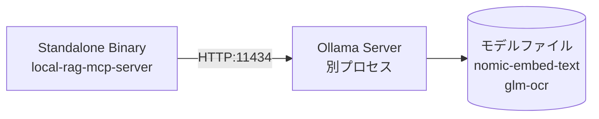
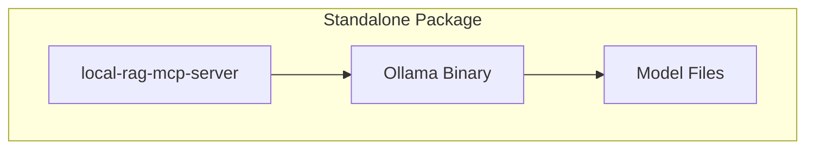
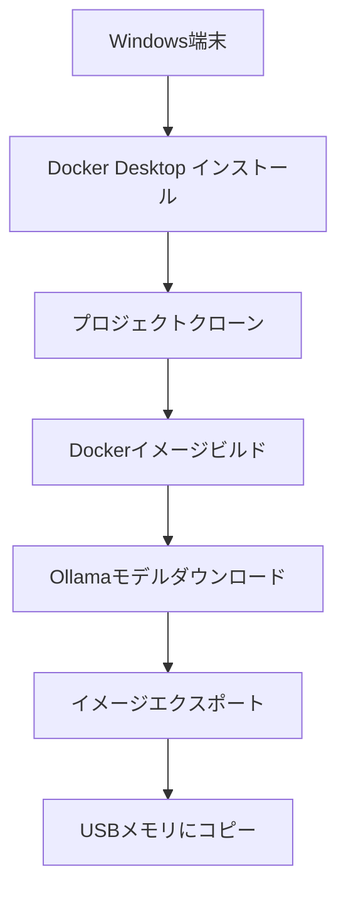
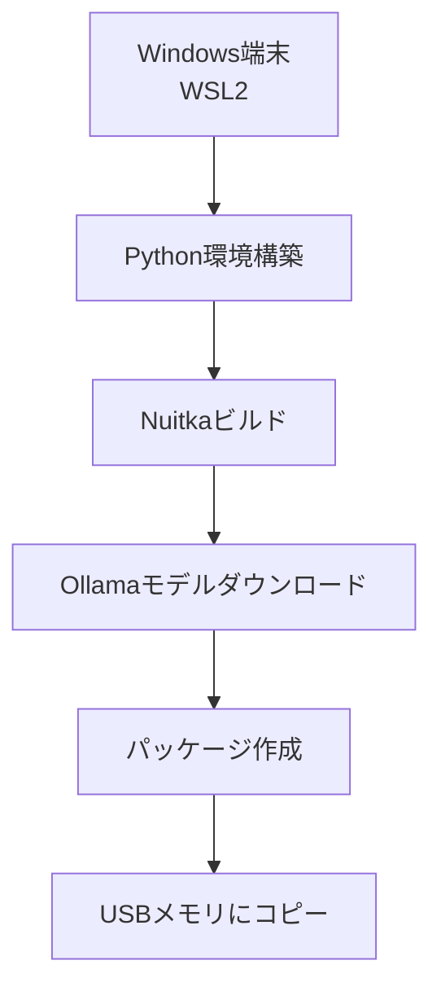
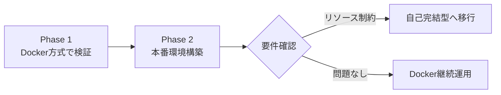

# オフライン環境向けインストール設計書

## 概要

本設計書は、Windows端末（ネット接続あり）からオフラインのUbuntu端末へ `local-rag-mcp-server` をインストールするための2つの方式を提案する。

1. **Dockerイメージ方式**: Dockerコンテナとしてパッケージ化
2. **自己完結型パッケージ方式**: Python実行環境を含むスタンドアロン形式

---

## 1. Dockerイメージ方式

### 1.1 アーキテクチャ概要

```mermaid
graph TB
    subgraph Docker Compose
        A[MCP Server Container<br/>local-rag-mcp-server]
        B[Ollama Container<br/>埋め込み/OCRモデル内蔵]
    end
    
    subgraph Volume Mounts
        C[(docs_dir<br/>ドキュメント)]
        D[(chroma_db<br/>ベクトルDB)]
        E[(models<br/>FlashRankキャッシュ)]
    end
    
    A --> B: HTTP:11434
    A --> C
    A --> D
    A --> E
    
    F[Ubuntu Host] -->|Port 8000| A
```

### 1.2 Dockerfile設計

#### 方針: Ollama分離型マルチステージビルド

Ollamaは公式イメージを使用し、MCPサーバーのみカスタムビルドする。

```dockerfile
# Dockerfile
# ============================================
# Stage 1: Builder - 依存関係のインストール
# ============================================
FROM python:3.11-slim AS builder

WORKDIR /app

# ビルド依存関係（一部パッケージで必要）
RUN apt-get update && apt-get install -y --no-install-recommends \
    build-essential \
    && rm -rf /var/lib/apt/lists/*

# 仮想環境を作成
RUN python -m venv /opt/venv
ENV PATH="/opt/venv/bin:$PATH"

# 依存関係をインストール
COPY requirements.txt .
RUN pip install --no-cache-dir --upgrade pip && \
    pip install --no-cache-dir -r requirements.txt

# ============================================
# Stage 2: Runtime - 最終イメージ
# ============================================
FROM python:3.11-slim AS runtime

WORKDIR /app

# 実行時に必要なシステムライブラリのみ
RUN apt-get update && apt-get install -y --no-install-recommends \
    # PyMuPDF用
    libmupdf-dev \
    # その他
    curl \
    && rm -rf /var/lib/apt/lists/*

# 仮想環境をコピー
COPY --from=builder /opt/venv /opt/venv
ENV PATH="/opt/venv/bin:$PATH"

# アプリケーションコード
COPY server.py .
COPY rag_engine.py .
COPY file_converter.py .
COPY ocr_engine.py .
COPY file_watcher.py .
COPY update_index.py .
COPY stop.py .
COPY _cleanup_db.py .

# 設定ファイル（テンプレート）
COPY config.json.example config.json.example

# ディレクトリ作成
RUN mkdir -p /app/converted_docs /app/chroma_db /app/models/flashrank_cache

# 環境変数
ENV PYTHONUNBUFFERED=1
ENV CHROMA_TELEMETRY=FALSE

# ポート公開
EXPOSE 8000

# エントリーポイント
COPY docker-entrypoint.sh /usr/local/bin/
RUN chmod +x /usr/local/bin/docker-entrypoint.sh
ENTRYPOINT ["docker-entrypoint.sh"]
CMD ["--transport", "sse", "--host", "0.0.0.0", "--port", "8000"]
```

#### エントリーポイントスクリプト

```bash
#!/bin/bash
# docker-entrypoint.sh
set -e

# config.json が存在しない場合はテンプレートからコピー
if [ ! -f /app/config.json ]; then
    cp /app/config.json.example /app/config.json
    echo "Created config.json from template"
fi

# Ollama接続確認（環境変数で指定可能）
OLLAMA_URL="${OLLAMA_BASE_URL:-http://ollama:11434}"
echo "Connecting to Ollama at: $OLLAMA_URL"

# サーバー起動
exec python server.py "$@"
```

### 1.3 docker-compose.yml設計

```yaml
# docker-compose.yml
version: "3.8"

services:
  # ============================================
  # MCP Server - RAGサーバー
  # ============================================
  mcp-server:
    build:
      context: .
      dockerfile: Dockerfile
    image: local-rag-mcp-server:latest
    container_name: local-rag-mcp-server
    restart: unless-stopped
    ports:
      - "8000:8000"
    volumes:
      # ドキュメントディレクトリ（読み取り専用推奨）
      - ${DOCS_DIR:-./documents}:/app/documents:ro
      # 変換済みドキュメント
      - converted_docs:/app/converted_docs
      # ChromaDB永続化
      - chroma_db:/app/chroma_db
      # FlashRankモデルキャッシュ
      - models:/app/models
      # 設定ファイル
      - ./config.json:/app/config.json:ro
    environment:
      - OLLAMA_BASE_URL=http://ollama:11434
      - PYTHONUNBUFFERED=1
    depends_on:
      ollama:
        condition: service_healthy
    networks:
      - rag-network
    healthcheck:
      test: ["CMD", "curl", "-f", "http://localhost:8000/sse"]
      interval: 30s
      timeout: 10s
      retries: 3
      start_period: 40s

  # ============================================
  # Ollama - 埋め込み/OCRモデルサーバー
  # ============================================
  ollama:
    image: ollama/ollama:latest
    container_name: ollama
    restart: unless-stopped
    ports:
      - "11434:11434"
    volumes:
      # モデル永続化
      - ollama_data:/root/.ollama
    environment:
      # GPU使用時はコメント解除
      # - NVIDIA_VISIBLE_DEVICES=all
      - OLLAMA_KEEP_ALIVE=24h
    networks:
      - rag-network
    healthcheck:
      test: ["CMD", "curl", "-f", "http://localhost:11434/api/tags"]
      interval: 30s
      timeout: 10s
      retries: 3
      start_period: 60s
    # GPU使用時のデプロイ設定
    # deploy:
    #   resources:
    #     reservations:
    #       devices:
    #         - driver: nvidia
    #           count: 1
    #           capabilities: [gpu]

volumes:
  converted_docs:
    driver: local
  chroma_db:
    driver: local
  models:
    driver: local
  ollama_data:
    driver: local

networks:
  rag-network:
    driver: bridge
```

### 1.4 イメージエクスポート/インポートスクリプト

#### Windows側（オンライン）: エクスポート

```powershell
# export-docker-image.ps1
# Windows PowerShell用スクリプト

param(
    [string]$OutputDir = ".\offline-package",
    [string]$ImageName = "local-rag-mcp-server:latest"
)

$ErrorActionPreference = "Stop"

Write-Host "=== Docker Image Export Script ===" -ForegroundColor Cyan

# 出力ディレクトリ作成
New-Item -ItemType Directory -Force -Path $OutputDir | Out-Null

# 1. イメージビルド
Write-Host "Building Docker image..." -ForegroundColor Yellow
docker-compose build

# 2. Ollamaイメージ取得
Write-Host "Pulling Ollama image..." -ForegroundColor Yellow
docker pull ollama/ollama:latest

# 3. イメージ保存
Write-Host "Exporting images..." -ForegroundColor Yellow
$McpImage = Join-Path $OutputDir "local-rag-mcp-server.tar"
$OllamaImage = Join-Path $OutputDir "ollama.tar"

docker save -o $McpImage $ImageName
docker save -o $OllamaImage ollama/ollama:latest

# 4. 設定ファイルとスクリプトをコピー
Write-Host "Copying configuration files..." -ForegroundColor Yellow
Copy-Item "docker-compose.yml" $OutputDir
Copy-Item "config.json.example" $OutputDir
Copy-Item "Dockerfile" $OutputDir -ErrorAction SilentlyContinue

# 5. インストールスクリプト作成
$InstallScript = @'
#!/bin/bash
# install.sh - Ubuntu用インストールスクリプト
set -e

echo "=== Local RAG MCP Server Installation ==="

# Dockerインストール確認
if ! command -v docker &> /dev/null; then
    echo "Docker not found. Installing Docker..."
    curl -fsSL https://get.docker.com -o get-docker.sh
    sudo sh get-docker.sh
    sudo usermod -aG docker $USER
    echo "Docker installed. Please log out and back in, then run this script again."
    exit 0
fi

# Docker Compose確認
if ! command -v docker-compose &> /dev/null && ! docker compose version &> /dev/null; then
    echo "Docker Compose not found. Installing..."
    sudo apt-get update
    sudo apt-get install -y docker-compose-plugin
fi

# イメージロード
echo "Loading Docker images..."
docker load -i local-rag-mcp-server.tar
docker load -i ollama.tar

# 設定ファイル作成
if [ ! -f config.json ]; then
    cp config.json.example config.json
    echo "Created config.json from template. Please edit as needed."
fi

# ドキュメントディレクトリ作成
mkdir -p documents

echo ""
echo "=== Installation Complete ==="
echo "Next steps:"
echo "1. Edit config.json to configure your document paths"
echo "2. Run: docker-compose up -d"
echo "3. Pull required Ollama models:"
echo "   docker exec -it ollama ollama pull nomic-embed-text-v2-moe"
echo "   docker exec -it ollama ollama pull glm-ocr"
echo ""
'@

$InstallScriptPath = Join-Path $OutputDir "install.sh"
$InstallScript | Out-File -FilePath $InstallScriptPath -Encoding UTF8

# 6. Ollamaモデルダウンロードスクリプト
$OllamaScript = @'
#!/bin/bash
# download-ollama-models.sh
# Windows側で実行し、モデルをダウンロードしてエクスポート

echo "Starting temporary Ollama container..."
docker run -d --name ollama-temp ollama/ollama:latest
sleep 10

echo "Downloading models..."
docker exec ollama-temp ollama pull nomic-embed-text-v2-moe
docker exec ollama-temp ollama pull glm-ocr

echo "Exporting models..."
docker stop ollama-temp
docker export ollama-temp -o ollama-with-models.tar
docker rm ollama-temp

echo "Models exported to ollama-with-models.tar"
'@

$OllamaScriptPath = Join-Path $OutputDir "download-ollama-models.sh"
$OllamaScript | Out-File -FilePath $OllamaScriptPath -Encoding UTF8

# サイズ表示
$TotalSize = (Get-ChildItem $OutputDir -Recurse | Measure-Object -Property Length -Sum).Sum / 1GB
Write-Host ""
Write-Host "Export complete!" -ForegroundColor Green
Write-Host "Output directory: $OutputDir"
Write-Host "Total size: $([math]::Round($TotalSize, 2)) GB"
Write-Host ""
Write-Host "Files created:"
Get-ChildItem $OutputDir | ForEach-Object { Write-Host "  - $($_.Name)" }
```

#### Ubuntu側（オフライン）: インポート

```bash
#!/bin/bash
# install-ubuntu.sh
# Ubuntu用インストールスクリプト

set -e

SCRIPT_DIR="$(cd "$(dirname "${BASH_SOURCE[0]}")" && pwd)"
cd "$SCRIPT_DIR"

echo "=== Local RAG MCP Server - Ubuntu Installation ==="
echo ""

# Dockerインストール確認
install_docker() {
    echo "Docker not found. Installing Docker..."
    
    # 依存パッケージ
    sudo apt-get update
    sudo apt-get install -y \
        apt-transport-https \
        ca-certificates \
        curl \
        gnupg \
        lsb-release
    
    # Docker公式GPGキー
    curl -fsSL https://download.docker.com/linux/ubuntu/gpg | sudo gpg --dearmor -o /usr/share/keyrings/docker-archive-keyring.gpg
    
    # リポジトリ追加
    echo \
        "deb [arch=$(dpkg --print-architecture) signed-by=/usr/share/keyrings/docker-archive-keyring.gpg] https://download.docker.com/linux/ubuntu \
        $(lsb_release -cs) stable" | sudo tee /etc/apt/sources.list.d/docker.list > /dev/null
    
    # Dockerインストール
    sudo apt-get update
    sudo apt-get install -y docker-ce docker-ce-cli containerd.io docker-compose-plugin
    
    # ユーザーをdockerグループに追加
    sudo usermod -aG docker $USER
    
    echo "Docker installed successfully!"
    echo "Please log out and back in, then run this script again."
    exit 0
}

if ! command -v docker &> /dev/null; then
    install_docker
fi

# Dockerサービス開始
sudo systemctl start docker
sudo systemctl enable docker

# イメージロード
echo "Loading Docker images..."
docker load -i local-rag-mcp-server.tar
docker load -i ollama.tar

# オフライン用Ollamaモデル（事前ダウンロード済みの場合）
if [ -f "ollama-with-models.tar" ]; then
    echo "Loading Ollama with pre-downloaded models..."
    docker import ollama-with-models.tar ollama-with-models:latest
fi

# 設定ファイル
if [ ! -f config.json ]; then
    cp config.json.example config.json
    echo "Created config.json from template."
fi

# ドキュメントディレクトリ作成
mkdir -p documents

# ボリュームディレクトリ作成
mkdir -p data/converted_docs data/chroma_db data/models

echo ""
echo "=== Installation Complete ==="
echo ""
echo "Next steps:"
echo "1. Place your documents in the 'documents' directory"
echo "2. Edit config.json:"
echo "   - Set source_docs_dir to your documents path"
echo "   - Set ollama_base_url to http://localhost:11434"
echo "3. Start services:"
echo "   docker-compose up -d"
echo "4. Pull Ollama models (if not pre-loaded):"
echo "   docker exec -it ollama ollama pull nomic-embed-text-v2-moe"
echo "   docker exec -it ollama ollama pull glm-ocr"
echo ""
```

### 1.5 ボリュームマウント戦略

| パス | 用途 | 永続化 | 備考 |
|------|------|--------|------|
| `/app/documents` | ソースドキュメント | Host mount (ro) | 読み取り専用推奨 |
| `/app/converted_docs` | 変換済みMDファイル | Named volume | 自動生成 |
| `/app/chroma_db` | ChromaDBデータ | Named volume | 重要: インデックス永続化 |
| `/app/models` | FlashRankモデル | Named volume | 初回DL後はオフライン動作可能 |
| `/root/.ollama` | Ollamaモデル | Named volume | 埋め込み/OCRモデル |

### 1.6 ネットワーク設定

```yaml
# 追加のネットワーク設定例

# ホストネットワーク使用（パフォーマンス優先）
# network_mode: host

# カスタムネットワーク
networks:
  rag-network:
    driver: bridge
    ipam:
      config:
        - subnet: 172.28.0.0/16
```

---

## 2. 自己完結型パッケージ方式

### 2.1 ツール選定比較

| ツール | メリット | デメリット | 推奨度 |
|--------|----------|------------|--------|
| **PyInstaller** | 実績豊富、クロスコンパイル対応 | 大きなバイナリ、一部パッケージで互換性問題 | ★★★☆☆ |
| **Nuitka** | 高速、Cコンパイル、サイズ最適化 | コンパイル時間が長い、Cコンパイラ必要 | ★★★★☆ |
| **cx_Freeze** | シンプル、Windows/Linux対応 | PyInstallerより実績少ない | ★★☆☆☆ |
| **PyApp** | Rust製、高速、小サイズ | 新しい、実績少ない | ★★☆☆☆ |

**推奨: Nuitka** - サイズ最適化と実行速度のバランスが良い

### 2.2 Nuitkaビルド設計

#### ビルドスクリプト

```bash
#!/bin/bash
# build-standalone.sh
# Linux向け自己完結型パッケージのビルド

set -e

PROJECT_NAME="local-rag-mcp-server"
VERSION="1.0.0"
BUILD_DIR="build"
DIST_DIR="dist"

echo "=== Building Standalone Package with Nuitka ==="

# クリーンアップ
rm -rf $BUILD_DIR $DIST_DIR
mkdir -p $DIST_DIR

# Nuitkaビルド
python -m nuitka \
    --standalone \
    --onefile \
    --output-dir=$BUILD_DIR \
    --output-filename=$PROJECT_NAME \
    --python-flag=no_site \
    --assume-yes-for-downloads \
    --include-package=mcp \
    --include-package=starlette \
    --include-package=uvicorn \
    --include-package=ollama \
    --include-package=chromadb \
    --include-package=rank_bm25 \
    --include-package=flashrank \
    --include-package=PIL \
    --include-package=watchdog \
    --include-package=psutil \
    --include-package=fitz \
    --include-package=openpyxl \
    --include-package=docx \
    --include-package=pptx \
    --include-data-file=config.json.example=config.json.example \
    server.py

# 実行ファイルをdistにコピー
cp $BUILD_DIR/$PROJECT_NAME $DIST_DIR/

# 設定ファイルテンプレート
cp config.json.example $DIST_DIR/

# README作成
cat > $DIST_DIR/README.txt << 'EOF'
Local RAG MCP Server - Standalone Package
===========================================

Requirements:
- Python 3.10+ (not required, standalone binary included)
- Ollama server running on localhost:11434

Setup:
1. Copy config.json.example to config.json
2. Edit config.json with your settings
3. Ensure Ollama is running with required models:
   - nomic-embed-text-v2-moe
   - glm-ocr

Run:
./local-rag-mcp-server --transport sse --host 0.0.0.0 --port 8000
EOF

echo "Build complete: $DIST_DIR/"
ls -la $DIST_DIR/
```

### 2.3 Linux向けビルドの課題と対策

| 課題 | 対策 |
|------|------|
| **glibc互換性** | 古いUbuntu（18.04+）でビルド、またはmanylinux使用 |
| **共有ライブラリ** | `--include-package`で全依存を含める |
| **ChromaDB SQLite** | `pysqlite3-binary`を追加、またはシステムSQLite使用 |
| **PyMuPDFネイティブ** | Nuitkaの`--include-package=fitz`で対応 |
| **サイズ増大** | `--onefile`で圧縮、UPXでさらに圧縮可能 |

### 2.4 Ollama連携方法

#### 方式A: 外部Ollama（推奨）



**メリット**:
- バイナリサイズが小さい
- Ollamaの更新が容易
- モデルの再利用が可能

**デメリット**:
- Ollamaの別途インストールが必要

#### 方式B: Ollama同梱（非推奨）



**メリット**:
- 完全自己完結

**デメリット**:
- パッケージサイズが10GB以上
- モデル更新が困難
- ライセンス問題の可能性

### 2.5 実行ファイルサイズ見積もり

| コンポーネント | 推定サイズ |
|---------------|-----------|
| Python Runtime | ~50MB |
| MCP/Starlette/Uvicorn | ~20MB |
| ChromaDB + 依存 | ~100MB |
| PyMuPDF | ~30MB |
| rank_bm25 + flashrank | ~10MB |
| その他依存 | ~40MB |
| **合計（圧縮なし）** | ~250MB |
| **合計（UPX圧縮）** | ~80-100MB |

**注意**: Ollamaモデルは含まず、別途インストール必要

### 2.6 オフラインインストール用パッケージ構成

```
offline-package/
├── local-rag-mcp-server          # 実行ファイル
├── config.json.example           # 設定テンプレート
├── README.txt                    # インストール手順
├── install.sh                    # インストールスクリプト
├── ollama-linux-amd64            # Ollamaバイナリ（オプション）
├── models/
│   ├── nomic-embed-text-v2-moe/  # 埋め込みモデル
│   └── glm-ocr/                  # OCRモデル
└── requirements/
    └── wheels/                   # Python wheel（予備）
```

---

## 3. オフラインインストール手順

### 3.1 Windows端末での準備手順

#### Dockerイメージ方式



**手順詳細**:

1. **Docker Desktop インストール**
   ```powershell
   # Docker Desktop for Windows をダウンロード・インストール
   # https://www.docker.com/products/docker-desktop
   ```

2. **プロジェクト準備**
   ```powershell
   git clone <repository-url>
   cd local-rag-mcp-server
   ```

3. **イメージビルド**
   ```powershell
   docker-compose build
   ```

4. **Ollamaモデルダウンロード**
   ```powershell
   # 一時コンテナでモデルダウンロード
   docker run -d --name ollama-temp ollama/ollama:latest
   docker exec ollama-temp ollama pull nomic-embed-text-v2-moe
   docker exec ollama-temp ollama pull glm-ocr
   docker commit ollama-temp ollama-with-models:latest
   docker stop ollama-temp
   docker rm ollama-temp
   ```

5. **エクスポート実行**
   ```powershell
   .\export-docker-image.ps1 -OutputDir .\offline-package
   ```

#### 自己完結型パッケージ方式



**手順詳細**:

1. **WSL2 Ubuntu環境準備**
   ```bash
   # WSL2 Ubuntu 22.04 を使用
   sudo apt update && sudo apt upgrade -y
   sudo apt install -y python3 python3-pip python3-venv
   ```

2. **Nuitkaインストール**
   ```bash
   pip install nuitka
   sudo apt install -y gcc g++  # Cコンパイラ
   ```

3. **ビルド実行**
   ```bash
   ./build-standalone.sh
   ```

4. **Ollamaモデルダウンロード**
   ```bash
   # Ollamaバイナリ取得
   curl -L https://ollama.com/download/ollama-linux-amd64 -o ollama
   
   # モデルダウンロード（オンライン環境必要）
   ./ollama pull nomic-embed-text-v2-moe
   ./ollama pull glm-ocr
   ```

5. **パッケージ作成**
   ```bash
   mkdir -p offline-package
   cp dist/local-rag-mcp-server offline-package/
   cp config.json.example offline-package/
   cp ollama offline-package/
   cp -r ~/.ollama offline-package/ollama_models
   tar -czvf offline-package.tar.gz offline-package/
   ```

### 3.2 USB転送等の方法

| 手段 | 容量目安 | 転送時間目安 | 注意点 |
|------|----------|--------------|--------|
| USB 3.0メモリ | 32GB以上推奨 | 5-15分 | FAT32は4GB制限あり、exFAT推奨 |
| 外付けHDD/SSD | 問題なし | 10-30分 | 高速転送可能 |
| ネットワーク（LAN） | - | 30-60分 | オフライン環境にLAN接続可能な場合 |

**推奨**: USB 3.0以上のメモリまたは外付けSSD

### 3.3 Ubuntu端末でのインストール手順

#### Dockerイメージ方式

```bash
# 1. USBメモリをマウント
sudo mkdir -p /mnt/usb
sudo mount /dev/sdX1 /mnt/usb  # sdX1は適切なデバイスに変更

# 2. パッケージをコピー
cp -r /mnt/usb/offline-package ~/
cd ~/offline-package

# 3. インストールスクリプト実行
chmod +x install-ubuntu.sh
./install-ubuntu.sh

# 4. ログアウト/ログイン（dockerグループ反映）

# 5. 設定ファイル編集
nano config.json
# source_docs_dir, docs_dir, ollama_base_url を設定

# 6. サービス起動
docker-compose up -d

# 7. 動作確認
curl http://localhost:8000/sse
```

#### 自己完結型パッケージ方式

```bash
# 1. USBメモリをマウント
sudo mkdir -p /mnt/usb
sudo mount /dev/sdX1 /mnt/usb

# 2. パッケージをコピー・展開
cp /mnt/usb/offline-package.tar.gz ~/
cd ~/
tar -xzvf offline-package.tar.gz
cd offline-package

# 3. Ollamaインストール（別途必要）
sudo cp ollama /usr/local/bin/
sudo chmod +x /usr/local/bin/ollama

# 4. Ollamaサービス起動
ollama serve &

# 5. モデル配置
mkdir -p ~/.ollama
cp -r ollama_models/* ~/.ollama/

# 6. 設定ファイル編集
cp config.json.example config.json
nano config.json

# 7. MCPサーバー起動
chmod +x local-rag-mcp-server
./local-rag-mcp-server --transport sse --host 0.0.0.0 --port 8000
```

---

## 4. 比較表

### 4.1 メリット/デメリット比較

| 項目 | Dockerイメージ方式 | 自己完結型パッケージ方式 |
|------|-------------------|------------------------|
| **セットアップ容易性** | ★★★☆☆ Docker知識必要 | ★★★★☆ 実行ファイルのみ |
| **環境隔離性** | ★★★★★ 完全隔離 | ★★★☆☆ システム依存 |
| **サイズ** | ★★★☆☆ 2-3GB | ★★★★☆ 100-250MB |
| **デバッグ容易性** | ★★★★☆ コンテナ内確認可能 | ★★☆☆☆ バイナリのため困難 |
| **更新容易性** | ★★★★☆ イメージ差し替え | ★★☆☆☆ 再ビルド必要 |
| **依存関係管理** | ★★★★★ Dockerfileで管理 | ★★★☆☆ ビルド時に固定 |
| **Ollama統合** | ★★★★★ 同一composeで管理 | ★★☆☆☆ 別プロセス |
| **セキュリティ** | ★★★★☆ コンテナ隔離 | ★★★☆☆ ホスト直接実行 |

### 4.2 ユースケース別推奨

| ユースケース | 推奨方式 | 理由 |
|-------------|----------|------|
| **初回導入・検証** | Docker | 環境隔離で安全に試行可能 |
| **本番運用** | Docker | 運用管理が容易 |
| **リソース制約環境** | 自己完結型 | メモリ・ディスク効率良好 |
| **頻繁な更新** | Docker | イメージ差し替えで更新容易 |
| **Docker未導入環境** | 自己完結型 | Docker不要で実行可能 |
| **セキュリティ重視** | Docker | コンテナ隔離による保護 |

### 4.3 技術要件比較

| 要件 | Docker方式 | 自己完結型方式 |
|------|-----------|---------------|
| **Ubuntu要件** | Docker CE必須 | glibc 2.31+ |
| **最小メモリ** | 4GB（コンテナ含む） | 2GB |
| **最小ディスク** | 10GB | 5GB |
| **ネットワーク** | 不要（オフライン可） | 不要（オフライン可） |
| **GPU対応** | NVIDIA Container Toolkit | CUDA直接インストール |

---

## 5. 推奨事項

### 5.1 優先推奨: Dockerイメージ方式

**理由**:
1. **環境再現性**: 開発環境と同一の環境を保証
2. **Ollama統合**: docker-composeで一元管理
3. **トラブルシューティング**: コンテナ内でログ確認・デバッグ可能
4. **更新管理**: イメージのバージョン管理が容易

### 5.2 代替推奨: 自己完結型パッケージ方式

**適用ケース**:
- Dockerインストールが困難な環境
- リソース（メモリ・ディスク）が制約される環境
- シンプルな実行ファイルとして配布したい場合

### 5.3 段階的導入提案



---

## 6. 実装チェックリスト

### Dockerイメージ方式

- [ ] Dockerfile作成
- [ ] docker-compose.yml作成
- [ ] エントリーポイントスクリプト作成
- [ ] エクスポートスクリプト作成（PowerShell）
- [ ] インストールスクリプト作成（Bash）
- [ ] Ollamaモデルダウンロードスクリプト作成
- [ ] README.md作成

### 自己完結型パッケージ方式

- [ ] Nuitkaビルドスクリプト作成
- [ ] 依存パッケージ確認・追加
- [ ] Ollama連携設定
- [ ] インストールスクリプト作成
- [ ] README.md作成

### 共通

- [ ] オフライン動作テスト
- [ ] ドキュメント整備
- [ ] エラーハンドリング確認

---

## 7. 参考資料

- [Docker公式ドキュメント](https://docs.docker.com/)
- [Nuitka公式ドキュメント](https://nuitka.net/)
- [Ollama公式ドキュメント](https://ollama.com/docs)
- [MCP Protocol仕様](https://modelcontextprotocol.io/)