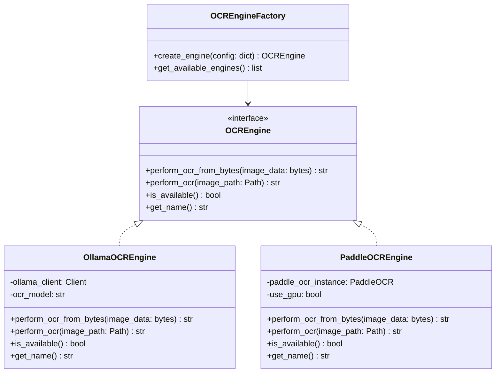
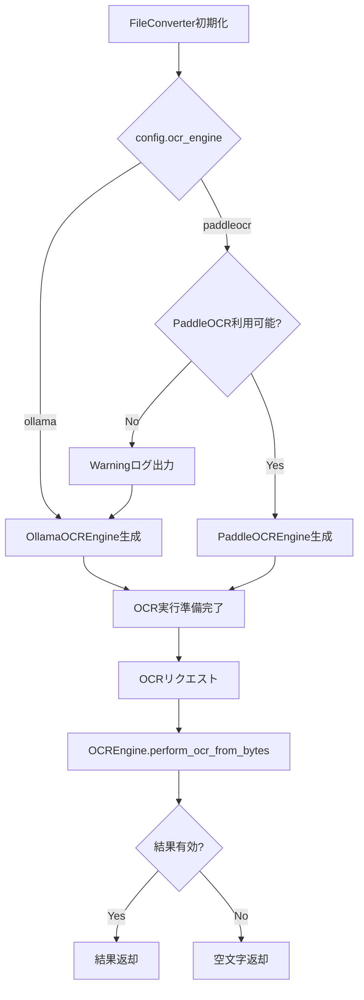
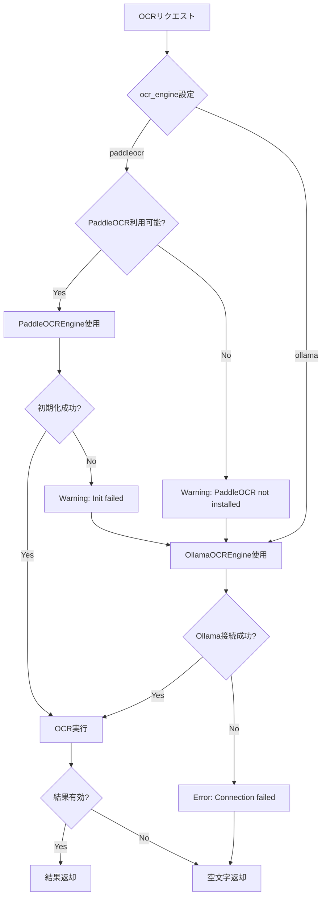

# PaddleOCRオプショナル化設計ドキュメント

## 1. 概要

### 1.1 目的
PaddleOCRをオプショナルな依存関係に変更し、Ollama glm-ocrを代替OCRエンジンとして使用できる設計を提案する。

### 1.2 背景
- PaddleOCRは初回使用時にモデルのダウンロードが発生する
- PaddleOCRライブラリがインストールされていない場合、インポートエラーが発生する可能性
- Ollamaにglm-ocrが入っていれば、PaddleOCRなしでもOCR機能を使用できるようにしたい

### 1.3 現状の問題点
1. `requirements.txt`にPaddleOCRが必須依存関係として記載されている
2. PaddleOCRのインポートエラー時の処理が分散している
3. OCRエンジンの切り替えロジックが`FileConverter`クラス内に埋め込まれている

---

## 2. アーキテクチャ概要

### 2.1 OCRエンジンの抽象化レイヤー



### 2.2 処理フロー



---

## 3. 変更箇所のリスト

### 3.1 新規ファイル

| ファイル | 説明 |
|---------|------|
| `ocr_engine.py` | OCRエンジンの抽象化レイヤー（インターフェース、実装、ファクトリー） |

### 3.2 変更ファイル

| ファイル | 変更内容 |
|---------|---------|
| `file_converter.py` | OCRエンジン抽象化レイヤーを使用するように変更 |
| `requirements.txt` | PaddleOCRをオプショナル依存関係に変更 |
| `config.json.example` | OCR設定のドキュメントを追加 |
| `README.md` | OCRエンジンの選択方法を追記 |

---

## 4. 詳細設計

### 4.1 `ocr_engine.py` - 新規ファイル

```python
"""
OCRエンジンの抽象化レイヤー
PaddleOCRとOllama glm-ocrを統一的なインターフェースで提供
"""
import sys
from abc import ABC, abstractmethod
from pathlib import Path
from typing import Optional, Tuple
import io

# PaddleOCRのオプショナルインポート
try:
    import os
    os.environ["PROTOCOL_BUFFERS_PYTHON_IMPLEMENTATION"] = "python"
    from paddleocr import PaddleOCR
    PADDLE_OCR_AVAILABLE = True
except ImportError:
    PADDLE_OCR_AVAILABLE = False

import ollama
from PIL import Image
import numpy as np


class OCREngine(ABC):
    """OCRエンジンの抽象基底クラス"""
    
    @abstractmethod
    def perform_ocr_from_bytes(self, image_data: bytes) -> str:
        """メモリ上の画像データからテキストを抽出"""
        pass
    
    def perform_ocr(self, image_path: Path) -> str:
        """ファイルパスからテキストを抽出"""
        try:
            with open(image_path, "rb") as f:
                image_data = f.read()
            return self.perform_ocr_from_bytes(image_data)
        except Exception as e:
            print(f"OCR error for {image_path}: {e}", file=sys.stderr)
            return ""
    
    @abstractmethod
    def is_available(self) -> bool:
        """エンジンが利用可能かどうか"""
        pass
    
    @abstractmethod
    def get_name(self) -> str:
        """エンジン名を取得"""
        pass


class OllamaOCREngine(OCREngine):
    """Ollama glm-ocrを使用するOCRエンジン"""
    
    # OCR出力の最小有効文字数
    _OCR_MIN_CHARS = 5
    # 繰り返し文字でのOCR失敗パターンを検出する閾値
    _OCR_REPEAT_THRESHOLD = 0.6
    # OCRプロンプト
    _OCR_PROMPT = "この画像に含まれるテキストや数式、サンプルコードを詳細に抽出してください。マークダウン形式で出力してください。"
    
    def __init__(self, ollama_base_url: str, ocr_model: str = "glm-ocr:latest"):
        self.ollama_client = ollama.Client(host=ollama_base_url)
        self.ocr_model = ocr_model
    
    def is_available(self) -> bool:
        # Ollamaサーバーへの接続確認は実際の使用時に行う
        return True
    
    def get_name(self) -> str:
        return f"Ollama ({self.ocr_model})"
    
    def perform_ocr_from_bytes(self, image_data: bytes) -> str:
        try:
            # 画像の前処理
            processed_image_data = self._preprocess_image(image_data)
            
            response = self.ollama_client.generate(
                model=self.ocr_model,
                prompt=self._OCR_PROMPT,
                images=[processed_image_data]
            )
            ocr_result = response["response"]
            
            if not self._is_ocr_output_valid(ocr_result):
                print(f"Ollama OCR output validation failed (model={self.ocr_model}).", file=sys.stderr)
                return ""
            
            return ocr_result
        except Exception as e:
            print(f"OCR error (Ollama): {e}", file=sys.stderr)
            return ""
    
    def _preprocess_image(self, image_data: bytes) -> bytes:
        """画像のリサイズ等の前処理"""
        with Image.open(io.BytesIO(image_data)) as img:
            img = img.convert("RGB")
            max_dim = 1536
            if max(img.size) > max_dim:
                ratio = max_dim / max(img.size)
                new_size = (int(img.width * ratio), int(img.height * ratio))
                print(f"Resizing image from {img.size} to {new_size}", file=sys.stderr)
                img = img.resize(new_size, Image.Resampling.LANCZOS)
            
            buf = io.BytesIO()
            img.save(buf, format="JPEG", quality=85)
            return buf.getvalue()
    
    def _is_ocr_output_valid(self, text: str) -> bool:
        """OCR出力が有効かどうかを検証"""
        stripped = text.strip()
        if not stripped:
            return False
        if self._OCR_PROMPT in stripped:
            print("OCR validation failed: prompt echo detected", file=sys.stderr)
            return False
        non_space = stripped.replace(' ', '').replace('\n', '').replace('\t', '')
        if len(non_space) < self._OCR_MIN_CHARS:
            print(f"OCR validation failed: output too short ({len(non_space)} chars)", file=sys.stderr)
            return False
        if len(non_space) > 10:
            most_common_char = max(set(non_space), key=non_space.count)
            ratio = non_space.count(most_common_char) / len(non_space)
            if ratio > self._OCR_REPEAT_THRESHOLD:
                print(f"OCR validation failed: repetitive output detected", file=sys.stderr)
                return False
        return True


class PaddleOCREngine(OCREngine):
    """PaddleOCRを使用するOCRエンジン"""
    
    def __init__(self, use_gpu: bool = False):
        self.use_gpu = use_gpu
        self._instance = None
    
    def is_available(self) -> bool:
        return PADDLE_OCR_AVAILABLE
    
    def get_name(self) -> str:
        return f"PaddleOCR (GPU={'enabled' if self.use_gpu else 'disabled'})"
    
    def _initialize(self) -> bool:
        """PaddleOCRインスタンスを初期化"""
        if self._instance is not None:
            return True
        
        if not PADDLE_OCR_AVAILABLE:
            return False
        
        try:
            # PaddleOCR v2.9+ via PaddleX might not accept use_gpu directly
            try:
                self._instance = PaddleOCR(
                    use_angle_cls=True, 
                    lang='japan', 
                    use_gpu=self.use_gpu, 
                    show_log=False
                )
            except (ValueError, TypeError):
                # Fallback for PaddleOCR v2.9+
                device = 'gpu' if self.use_gpu else 'cpu'
                self._instance = PaddleOCR(
                    use_angle_cls=True, 
                    lang='japan', 
                    device=device
                )
            return True
        except Exception as e:
            print(f"Failed to initialize PaddleOCR: {e}", file=sys.stderr)
            return False
    
    def perform_ocr_from_bytes(self, image_data: bytes) -> str:
        if not self._initialize():
            return ""
        
        try:
            # 画像の前処理
            img_array = self._preprocess_image(image_data)
            
            try:
                result = self._instance.ocr(img_array, cls=True)
            except TypeError:
                # PaddleOCR v2.9+ (PaddleX wrapper) drops the cls argument
                result = self._instance.ocr(img_array)
            
            if not result or not result[0]:
                return ""
            
            # 結果のテキストを結合
            extracted_text = []
            
            if isinstance(result[0], dict) and 'rec_text' in result[0]:
                # PaddleX pipeline return format
                for text in result[0]['rec_text']:
                    extracted_text.append(text)
            else:
                # Classic PaddleOCR format
                for line in result[0]:
                    if isinstance(line, list) and len(line) == 2 and isinstance(line[1], tuple):
                        text = line[1][0]
                        extracted_text.append(text)
                    else:
                        extracted_text.append(str(line))
            
            return "\n".join(extracted_text)
        except Exception as e:
            print(f"OCR error (PaddleOCR): {e}", file=sys.stderr)
            return ""
    
    def _preprocess_image(self, image_data: bytes):
        """画像の前処理（numpy配列を返す）"""
        with Image.open(io.BytesIO(image_data)) as img:
            img = img.convert("RGB")
            max_dim = 1536
            if max(img.size) > max_dim:
                ratio = max_dim / max(img.size)
                new_size = (int(img.width * ratio), int(img.height * ratio))
                print(f"Resizing image from {img.size} to {new_size}", file=sys.stderr)
                img = img.resize(new_size, Image.Resampling.LANCZOS)
            return np.array(img)


class OCREngineFactory:
    """OCRエンジンのファクトリークラス"""
    
    @staticmethod
    def create_engine(config: dict) -> OCREngine:
        """
        設定に基づいてOCRエンジンを作成
        
        Args:
            config: 設定辞書。以下のキーを使用:
                - ocr_engine: "ollama" または "paddleocr"
                - ocr_model: Ollamaモデル名（デフォルト: "glm-ocr:latest"）
                - ollama_base_url: OllamaサーバーURL
                - paddleocr_use_gpu: PaddleOCRでGPUを使用するか
        
        Returns:
            OCREngine: 適切なOCRエンジンインスタンス
        """
        ocr_engine = config.get("ocr_engine", "ollama").lower()
        
        if ocr_engine == "paddleocr":
            if not PADDLE_OCR_AVAILABLE:
                print(
                    "Warning: PaddleOCR is configured as the ocr_engine, "
                    "but paddleocr is not installed. Falling back to ollama.",
                    file=sys.stderr
                )
                # フォールバック
                return OCREngineFactory._create_ollama_engine(config)
            
            use_gpu = config.get("paddleocr_use_gpu", False)
            return PaddleOCREngine(use_gpu=use_gpu)
        
        elif ocr_engine == "ollama":
            return OCREngineFactory._create_ollama_engine(config)
        
        else:
            print(
                f"Warning: Unknown ocr_engine '{ocr_engine}'. "
                "Falling back to ollama.",
                file=sys.stderr
            )
            return OCREngineFactory._create_ollama_engine(config)
    
    @staticmethod
    def _create_ollama_engine(config: dict) -> OllamaOCREngine:
        """Ollama OCRエンジンを作成"""
        ollama_base_url = config.get("ollama_base_url", "http://localhost:11434")
        ocr_model = config.get("ocr_model", "glm-ocr:latest")
        return OllamaOCREngine(ollama_base_url=ollama_base_url, ocr_model=ocr_model)
    
    @staticmethod
    def get_available_engines() -> list:
        """利用可能なOCRエンジンのリストを取得"""
        engines = ["ollama"]  # Ollamaは常に利用可能
        if PADDLE_OCR_AVAILABLE:
            engines.append("paddleocr")
        return engines
```

### 4.2 `file_converter.py` - 変更内容

**変更前（現在の実装）:**
- PaddleOCRのインポートと初期化が`__init__`内に埋め込まれている
- OCR処理ロジックが`perform_ocr_from_bytes`内に直接記述されている

**変更後:**
```python
# ファイル先頭のインポート部分
from ocr_engine import OCREngineFactory, OCREngine

class FileConverter:
    def __init__(self, config_path: str = "config.json"):
        # ... 既存の設定読み込み処理 ...
        
        # OCRエンジンの初期化（抽象化レイヤーを使用）
        self.ocr_engine_instance: OCREngine = OCREngineFactory.create_engine(self.config)
        print(f"OCR engine initialized: {self.ocr_engine_instance.get_name()}", file=sys.stderr)
    
    def perform_ocr_from_bytes(self, image_data: bytes) -> str:
        """メモリ上の画像データからテキストを抽出する"""
        return self.ocr_engine_instance.perform_ocr_from_bytes(image_data)
    
    def perform_ocr(self, image_path: Path) -> str:
        """ファイルパスからテキストを抽出する"""
        return self.ocr_engine_instance.perform_ocr(image_path)
```

### 4.3 `requirements.txt` - 変更内容

**変更前:**
```
# --- OCR Dependencies ---
# PaddleOCR engine (Compatible stack: paddleocr >= 2.7.3, paddlepaddle >= 2.6.0, numpy >= 1.23.2)
paddleocr>=2.7.3
numpy>=1.23.2
# Note: Users must manually install the appropriate PaddlePaddle backend.
# For CPU: pip install paddlepaddle>=2.6.0
# For GPU: pip install paddlepaddle-gpu>=2.6.0
```

**変更後:**
```
# --- Core Dependencies ---
# (既存の必須依存関係はそのまま)

# --- OCR Dependencies ---
# Ollama OCR is used by default (requires Ollama server with glm-ocr model)
# PaddleOCR is optional and can be installed separately

# Optional: PaddleOCR engine
# To use PaddleOCR instead of Ollama, install with:
# pip install paddleocr>=2.7.3 paddlepaddle>=2.6.0
# For GPU support: pip install paddleocr>=2.7.3 paddlepaddle-gpu>=2.6.0
# Note: numpy>=1.23.2 is required for PaddleOCR

# --- Optional Dependencies ---
# Install with: pip install -r requirements.txt --extra-index-url https://pypi.org/simple/
# Or for PaddleOCR support: pip install local-rag-mcp-server[paddleocr]
```

### 4.4 `config.json.example` - 変更内容

**変更前:**
```json
{
  "ocr_engine": "ollama",
  "ocr_model": "glm-ocr:latest",
  "paddleocr_use_gpu": false
}
```

**変更後:**
```json
{
  "ocr_engine": "ollama",
  "ocr_model": "glm-ocr:latest",
  "paddleocr_use_gpu": false,
  "_ocr_help": {
    "ocr_engine": "OCR engine to use: 'ollama' (default) or 'paddleocr' (optional)",
    "ocr_model": "Ollama model for OCR (default: glm-ocr:latest). Make sure the model is pulled in Ollama.",
    "paddleocr_use_gpu": "Use GPU for PaddleOCR (only effective when ocr_engine='paddleocr'). Requires paddlepaddle-gpu.",
    "note": "PaddleOCR is optional. If 'paddleocr' is specified but not installed, falls back to 'ollama'."
  }
}
```

---

## 5. 設定ファイルの変更

### 5.1 新しい設定構造

```json
{
  "source_docs_dir": "C:\\path\\to\\your\\documents",
  "docs_dir": "converted_docs",
  "embedding_model": "nomic-embed-text-v2-moe:latest",
  
  "ocr_engine": "ollama",
  "ocr_model": "glm-ocr:latest",
  "paddleocr_use_gpu": false,
  
  "ollama_base_url": "http://localhost:11434",
  "extra_text_extensions": [".conf", ".ini", ".env", ".log"],
  "db_dir": "./chroma_db",
  "collection_name": "mcp_rag_collection"
}
```

### 5.2 設定値の説明

| 設定キー | 型 | デフォルト値 | 説明 |
|---------|---|-------------|------|
| `ocr_engine` | string | `"ollama"` | OCRエンジン選択。`"ollama"` または `"paddleocr"` |
| `ocr_model` | string | `"glm-ocr:latest"` | Ollamaで使用するOCRモデル |
| `paddleocr_use_gpu` | boolean | `false` | PaddleOCRでGPUを使用するか |

---

## 6. エラーハンドリング

### 6.1 シナリオ別エラー処理

| シナリオ | 処理 | ユーザーへの通知 |
|---------|------|-----------------|
| PaddleOCR未インストールで`ocr_engine="paddleocr"`指定 | Ollamaにフォールバック | Warningログ出力 |
| PaddleOCR初期化エラー | Ollamaにフォールバック | Warningログ出力 |
| Ollamaサーバー接続エラー | 空文字を返却 | Errorログ出力 |
| OCRモデル未プル（Ollama） | 空文字を返却 | Errorログ出力 |
| 画像処理エラー | 空文字を返却 | Errorログ出力 |

### 6.2 エラー処理フロー



---

## 7. ログ出力

### 7.1 ログレベルとメッセージ

| レベル | タイミング | メッセージ例 |
|-------|----------|-------------|
| INFO | サーバー起動時 | `OCR engine initialized: Ollama (glm-ocr:latest)` |
| WARNING | PaddleOCR未インストール | `PaddleOCR is configured as the ocr_engine, but paddleocr is not installed. Falling back to ollama.` |
| WARNING | PaddleOCR初期化失敗 | `Failed to initialize PaddleOCR: {error}. Falling back to ollama.` |
| ERROR | OCR実行エラー | `OCR error (Ollama): {error}` |
| DEBUG | 画像リサイズ | `Resizing image from {size} to {new_size}` |

### 7.2 起動時のログ出力例

**正常系（Ollama使用）:**
```
OCR engine initialized: Ollama (glm-ocr:latest)
```

**正常系（PaddleOCR使用）:**
```
OCR engine initialized: PaddleOCR (GPU=disabled)
```

**フォールバック時:**
```
Warning: PaddleOCR is configured as the ocr_engine, but paddleocr is not installed. Falling back to ollama.
OCR engine initialized: Ollama (glm-ocr:latest)
```

---

## 8. 移行ガイド

### 8.1 既存ユーザー向け

1. **PaddleOCRを引き続き使用する場合:**
   - 追加の作業は不要
   - `requirements.txt`にPaddleOCRを追加してインストール

2. **Ollamaに移行する場合:**
   - `config.json`の`ocr_engine`を`"ollama"`に変更
   - Ollamaサーバーを起動し、`glm-ocr`モデルをプル:
     ```bash
     ollama pull glm-ocr
     ```

### 8.2 新規ユーザー向け

1. **最小構成（Ollamaのみ）:**
   ```bash
   pip install -r requirements.txt  # PaddleOCRは含まれない
   ollama pull glm-ocr
   ```

2. **PaddleOCRを使用する場合:**
   ```bash
   pip install paddleocr paddlepaddle
   # または GPU版
   pip install paddleocr paddlepaddle-gpu
   ```

---

## 9. テスト計画

### 9.1 テストケース

| テストケース | 期待結果 |
|-------------|---------|
| Ollama設定で起動 | OllamaOCREngineが初期化される |
| PaddleOCR設定で起動（インストール済み） | PaddleOCREngineが初期化される |
| PaddleOCR設定で起動（未インストール） | Ollamaにフォールバック、Warningログ |
| 不正なocr_engine設定 | Ollamaにフォールバック、Warningログ |
| Ollamaサーバー未起動 | 空文字返却、Errorログ |
| PDFファイルのOCR | 正常にテキスト抽出 |

### 9.2 統合テスト

```python
# test_ocr_engine.py
import pytest
from ocr_engine import OCREngineFactory, OllamaOCREngine, PaddleOCREngine

def test_factory_creates_ollama_engine():
    config = {"ocr_engine": "ollama", "ocr_model": "glm-ocr:latest"}
    engine = OCREngineFactory.create_engine(config)
    assert isinstance(engine, OllamaOCREngine)

def test_factory_fallback_to_ollama():
    config = {"ocr_engine": "paddleocr"}  # PaddleOCR未インストール想定
    engine = OCREngineFactory.create_engine(config)
    assert isinstance(engine, OllamaOCREngine)

def test_available_engines():
    engines = OCREngineFactory.get_available_engines()
    assert "ollama" in engines
```

---

## 10. まとめ

この設計により、以下のメリットが得られます：

1. **柔軟性**: ユーザーはPaddleOCRまたはOllamaを選択可能
2. **後方互換性**: 既存のPaddleOCRユーザーは引き続き使用可能
3. **堅牢性**: PaddleOCR未インストール時の自動フォールバック
4. **保守性**: OCRロジックが1箇所に集約され、変更が容易
5. **拡張性**: 新しいOCRエンジンの追加が容易（インターフェースを実装するだけで良い）